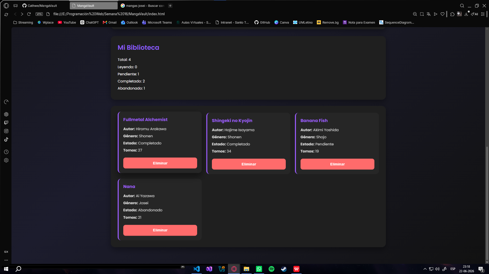
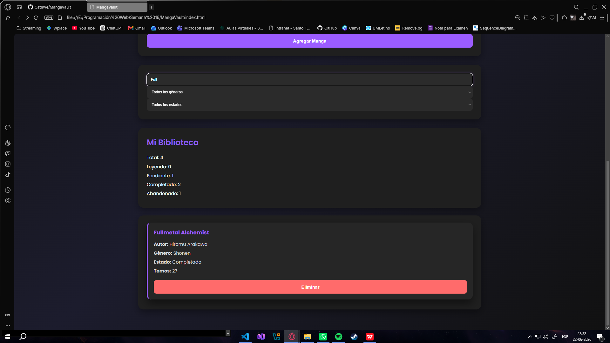
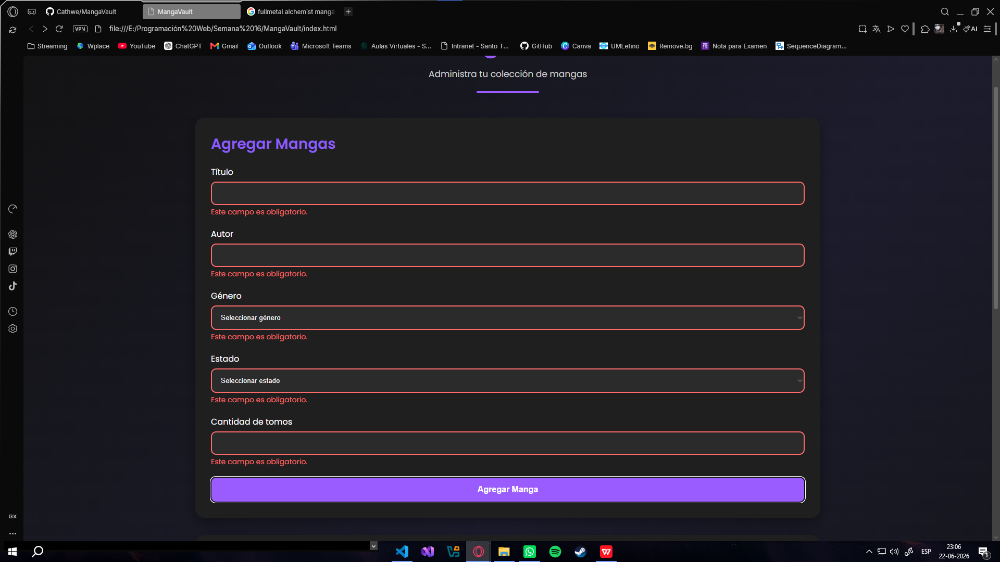
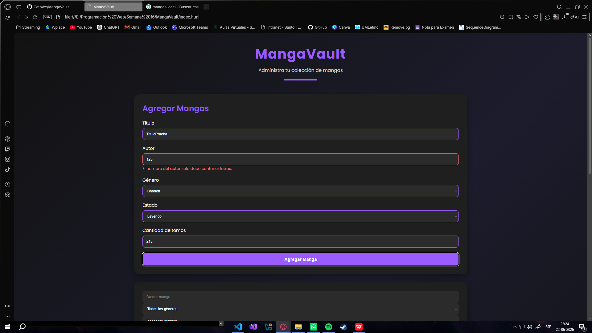
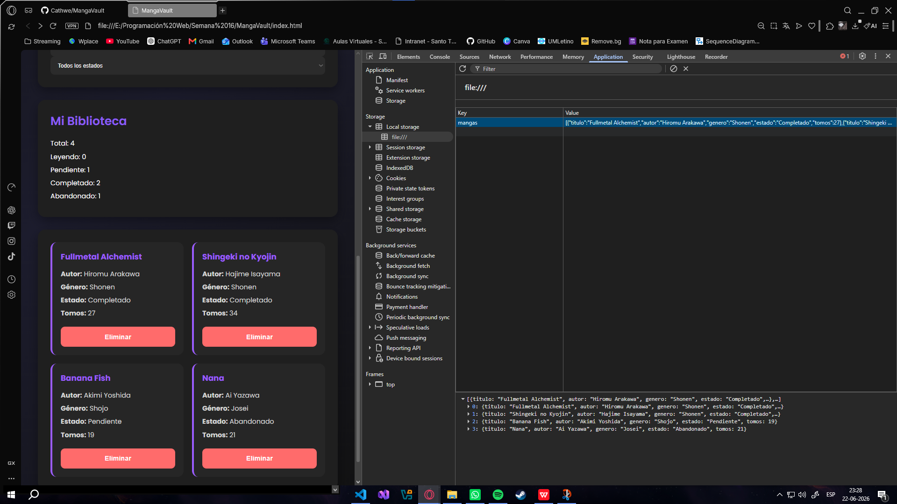

# MangaVault - Mini-Aplicación Web Interactiva

## 1. Objetivo del Proyecto y Descripción Funcional
MangaVault es una plataforma frontend interactiva diseñada para que los lectores de manga puedan administrar, clasificar y realizar un seguimiento del estado de su colección personal (Biblioteca) en tiempo real. La aplicación permite registrar nuevos títulos con su respectivo autor, género, estado de lectura y cantidad de tomos, ofreciendo herramientas de búsqueda y filtrado dinámico junto con un panel de estadísticas cuantitativas.

## 2. Lista de Control de Requerimientos Técnicos Cumplidos (Checklist)
- [x] **Bloque 1: Estructura y maqueta:** Proyecto creado desde cero con separación estricta de responsabilidades (HTML para estructura, CSS para presentación y JS para comportamiento). Sin uso de estilos inline ni JavaScript en atributos HTML (evitando directivas obsoletas como `onclick`). Diseño responsive y jerarquía visual clara.
- [x] **Bloque 2: Interacción con DOM y eventos:** Selección de elementos mediante selectores modernos (`getElementById`). Uso de 3 tipos de eventos distintos con `addEventListener` (`submit`, `input` y `change`). Generación dinámica de tarjetas mediante `document.createElement()` y destrucción de nodos del DOM mediante delegación de eventos para la eliminación individual.
- [x] **Bloque 3: Formulario y validaciones:** Formulario integrado por 5 campos. Implementación de 5 reglas de validación (Campos obligatorios, formato específico mediante expresión regular para el autor, longitud mínima para el título, coincidencia cruzada/dependencia lógica entre estado y tomos, y regla de negocio de valor único no repetido). Control absoluto del envío con `event.preventDefault()` y feedback visual de estados válido/inválido con CSS.
- [x] **Bloque 4: Datos y persistencia:** Implementación completa de la opción de LocalStorage usando `setItem()`, `getItem()` y `JSON.parse()`. Capacidad de gestión CRUD básica (crear y eliminar registros de manera individual) y manejo seguro del caso de borde de LocalStorage vacío en la carga inicial de la app.
- [x] **Bloque 5: Usabilidad y calidad:** Interfaz compatible y probada en dimensiones de escritorio y dispositivos móviles a través de las DevTools. Cero errores críticos reportados en la consola del desarrollador. Código estructurado de forma legible con identificadores descriptivos y comentarios técnicos de contexto.
- [x] **Bloque 6: Versionamiento y entrega:** Repositorio público en GitHub creado desde cero con un avance técnico secuencial reflejado en un historial de commits estructurado.

## 3. Instrucciones Operativas para Desplegar y Correr la Aplicación
Para ejecutar este proyecto de forma inmediata en cualquier entorno local:
1. Descargue el código fuente o clone este repositorio en su equipo local.
2. Navegue hasta el directorio raíz del proyecto (`MangaVault/`).
3. Abra el archivo `index.html` haciendo doble clic sobre él o arrastrándolo hacia cualquier navegador web moderno (Google Chrome, Microsoft Edge o Mozilla Firefox).
4. La aplicación se ejecutará de forma autónoma en el frontend, ya que no requiere de la instalación de dependencias complejas, servidores locales ni configuraciones de backend pesadas.

## 4. Evidencias de Funcionamiento

### Interfaz Principal y Funcionamiento Coherente

Aquí se puede apreciar la biblioteca con datos cargados, mostrando las tarjetas renderizadas dinámicamente y el panel de estadísticas funcionando perfectamente.

### Filtrado de Búsqueda

Demostración que según el filtrado se muestre la tarjeta correspondiente.

### Sistema de Validación en Acción

Captura que demuestra el bloqueo del envío mediante `event.preventDefault()`, mostrando los mensajes de error correspondientes y el feedback visual en los bordes.

### Persistencia de Datos (LocalStorage)

Evidencia de la consola de desarrollador (DevTools -> Application) donde se comprueba que los mangas quedan guardados de forma persistente en formato JSON en el navegador.

---

## 📊 Autoevaluación de Criterios Institucionales

| Criterio de la Rúbrica (Escala 7/5/4/2 Puntos) | Sección del Proyecto que lo Cubre | Estado de Cumplimiento | Nota Esperada |
| :--- | :--- | :---: | :---: |
| Integración con maqueta y estructura del proyecto | Bloque 1: Estructura y maqueta | Totalmente Cumplido | 7.0 |
| DOM y eventos (interactividad) | Bloque 2: Interacción con DOM y eventos | Totalmente Cumplido | 7.0 |
| Formulario y validaciones | Bloque 3: Formulario y validaciones | Totalmente Cumplido | 7.0 |
| Datos y persistencia | Bloque 4: Datos y persistencia | Totalmente Cumplido | 7.0 |
| Usabilidad, compatibilidad y depuración | Bloque 5: Usabilidad y calidad | Totalmente Cumplido | 7.0 |
| Documentación, Git y comunicación técnica | Bloque 6: Versionamiento y entrega | Totalmente Cumplido | 7.0 |

---

## ✒️ Autoría
* **Estudiante:** Camila Ávila Salas
* **Carrera:** Ingeniería en Informática
* **Asignatura:** Programación Web
* **Institución:** Instituto Profesional Santo Tomás, Sede Talca
* **Repositorio oficial:** [Cathwe/MangaVault](https://github.com/Cathwe/MangaVault)